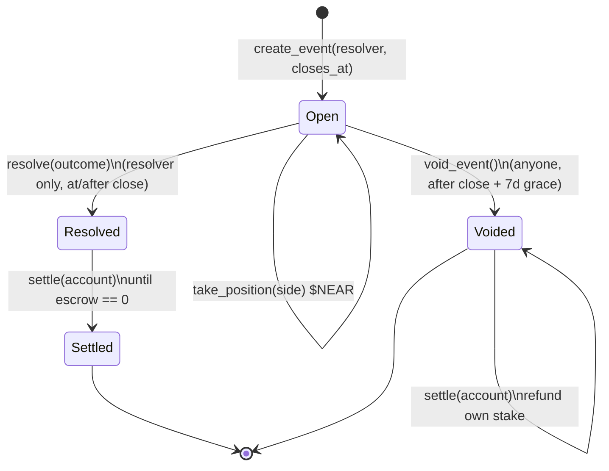

# Settlemint

**A NEAR event market that settles itself, to the last yocto.**

One resolver opens a binary Yes/No market on NEAR. Stakers commit yoctoNEAR while
it is open. When the outcome is known, the resolver records it once and every
winner is paid pro rata in a single pass. The last winner sweeps the rounding
dust, so escrow lands at exactly zero and no stake is stranded. If the resolver
never shows up, anyone can void the market after a grace window and every staker
withdraws their own stake. No path locks funds.

This repository is **milestone 1**: the NEAR-native Rust settlement core, a
Python mirror of the same arithmetic kept in cross-language parity by tests, a
deterministic recorded run, and a self-contained UI that replays a market from
open to settled.

```
cargo test        ->  23 passing   (contract/src/lib.rs, NEAR unit-testing harness)
pytest tests -q   ->  32 passing   (model, cross-language parity, run fixture, adapter)
release WASM      ->  205 KB       (cargo build --release --target wasm32-unknown-unknown)
```

> Testnet only. No mainnet, no public testnet receipt yet, no users, no revenue,
> no audit. See [`docs/LIMITATIONS.md`](docs/LIMITATIONS.md).

---

## The mechanism



- **Open.** `create_event` names a resolver and a close timestamp. Accounts
  `take_position` with attached yoctoNEAR on Yes or No while the market is open.
- **Resolved.** Only the named resolver may `resolve`, and only at or after
  close, so the market cannot be cut off mid-flight. The winning-side stake is
  frozen as the outstanding liability.
- **Settled.** `settle` pays each account pro rata to its winning-side stake. The
  last unclaimed winner receives the remaining escrow rather than a floor-divided
  share, so dust is paid out, not stranded. The market becomes `Settled` only
  once escrow reaches zero, so a partly-paid market is never reported as final.
- **Voided.** If the resolver never resolves, anyone may `void_event` after
  `close + 7 days`. Every staker then withdraws exactly their own stake. A lost
  or silent resolver key cannot lock funds.

Conservation is structural: `escrow` tracks the yoctoNEAR still held per event
and every payout decrements it, so the sum of payouts always equals the sum of
stakes. The parity suite pins this in two languages at once.

## Why NEAR carries this

NEAR's account model and named function-call access keys let the operator agent
hold a key scoped to `resolve` and `settle` only, rather than a full-access key,
so a compromised agent can settle markets but cannot drain an account. NEAR's low
predictable fees make the one-resolve-plus-one-settle-pass pattern cheap enough
to run at cadence. The contract is NEAR-native Rust compiled to WASM, not a
Solidity port: the state machine and its arithmetic were reimplemented against
the NEAR runtime.

The funder's technology is load-bearing behind an adapter seam
(`settlemint/near.py`): a `LiveNearClient` talks to a real NEAR testnet over
JSON-RPC when `NEAR_RPC_URL` and a signer are configured and **refuses any
mainnet endpoint**, while an `OfflineNearClient` replays the deterministic model
so the whole thing runs keyless. This repo ships no funded key, so it runs
offline; the live seam is exercised in milestone 3.

## Run it

```bash
# NEAR-native settlement core (Rust unit tests)
cd contract && cargo test

# build the deployable testnet WASM
cargo build --release --target wasm32-unknown-unknown

# off-chain model, cross-language parity, and the recorded-run fixture
cd .. && PYTHONPATH=. python -m pytest tests -q

# regenerate the recorded run the UI renders
python scripts/record_run.py

# open the UI (self-contained, file://, no network)
open ui/index.html
```

## Layout

```
contract/src/lib.rs        NEAR Rust settlement core + 23 unit tests (the milestone-1 deliverable)
contract/Cargo.toml        near-sdk 5.6.0, pinned; release profile for WASM
settlemint/model.py        pure-Python mirror of the settlement arithmetic
settlemint/near.py         adapter seam: LiveNearClient (testnet only) / OfflineNearClient
scripts/record_run.py      drives a full lifecycle, writes docs/run.json
tests/                     model, parity, run-fixture, and adapter suites (32 tests)
agent_core/                vendored doom2quake agent-core (used by the milestone-3 operator agent)
ui/index.html              self-contained replay of a market, open to settled
docs/run.json              the recorded run the UI renders
docs/LIMITATIONS.md        what is not built, deployed, or measured
paper/ deck/ DEMO.md       write-up, slides, and a two-minute demo script
```

## Cite

```bibtex
@software{sarkar_settlemint_2026,
  title   = {Settlemint: a self-settling event market for NEAR},
  author  = {Dipankar Sarkar},
  year    = {2026},
  url     = {https://github.com/doom2quake/settlemint-near},
  license = {MIT}
}
```
