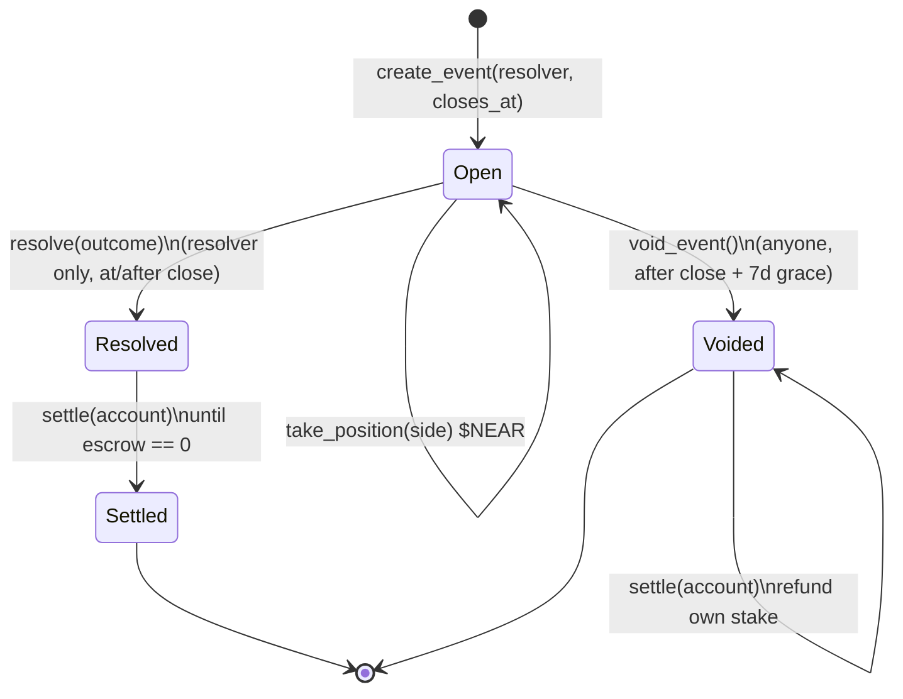
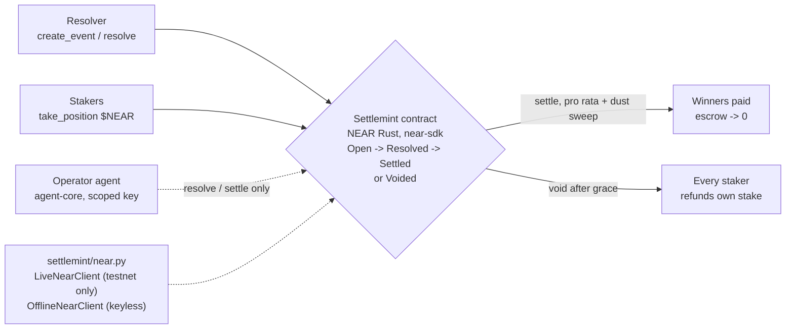
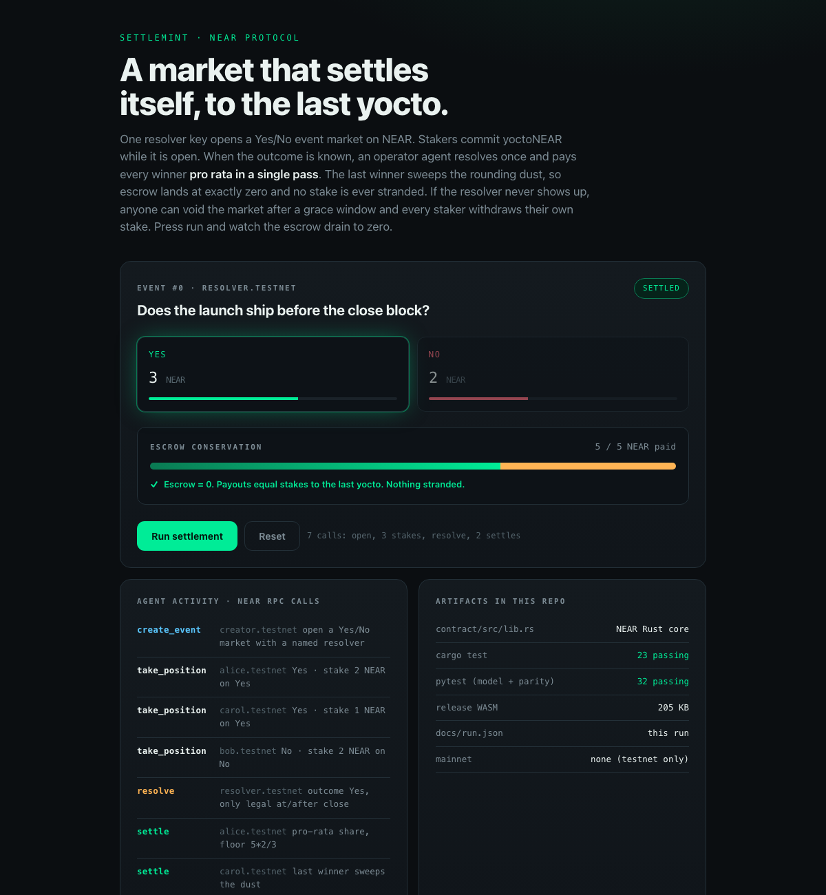

# Settlemint

A NEAR-native event market that **settles itself, to the last yocto**. One resolver
opens a binary Yes/No market. Stakers commit yoctoNEAR while it is open. When the
outcome is known, the resolver records it once and every winner is paid pro rata in a
single pass. The **last** winner sweeps the rounding dust, so escrow lands at exactly
zero and no stake is stranded. If the resolver never shows up, anyone can void the
market after a grace window and every staker withdraws their own stake. **No path
locks funds.**

On NEAR the settlement is native Rust compiled to WASM, and an operator agent can hold
a function-call access key scoped to `resolve` and `settle` only, so a compromised
agent can advance markets but cannot drain an account.

**Milestone 1** of the Settlemint proposal to NEAR Protocol Rewards: the NEAR-native
Rust settlement core, a Python mirror of the same arithmetic held in cross-language
parity by tests, a deterministic recorded run, and a self-contained UI. NEAR testnet
only, never mainnet.

**[▶ Live demo](https://doom2quake.github.io/near-rewards/ui/)**  ·  **[Watch the walkthrough](https://youtu.be/SETTLEMINT_VIDEO)**  ·  **[Paper (PDF)](paper/paper.pdf)**  ·  **[Deck (PDF)](deck/deck.pdf)**  ·  Built on **[NEAR](https://near.org/)**

Read [docs/LIMITATIONS.md](docs/LIMITATIONS.md) first for the short version of what is
proved, what is simulated, and what is not built. Nothing on this page contradicts it.

## The mechanism



- **Open.** `create_event` names a resolver and a close timestamp. Accounts
  `take_position` with attached yoctoNEAR on Yes or No while the market is open.
- **Resolved.** Only the named resolver may `resolve`, and only at or after close, so
  the market cannot be cut off mid-flight. The winning-side stake is frozen as the
  outstanding liability.
- **Settled.** `settle` pays each account pro rata to its winning-side stake. The last
  unclaimed winner receives the remaining escrow rather than a floor-divided share, so
  dust is paid out, not stranded. The market becomes `Settled` only once escrow reaches
  zero, so a partly-paid market is never reported as final.
- **Voided.** If the resolver never resolves, anyone may `void_event` after
  `close + 7 days`. Every staker then withdraws exactly their own stake. A lost or
  silent resolver key cannot lock funds.

Conservation is structural: `escrow` tracks the yoctoNEAR still held per event and
every payout decrements it, so the sum of payouts always equals the sum of stakes.
`test_parity.py` pins this in two languages at once, and every defence in this repo has
a test that fails without it.

## Architecture



- **`contract/src/lib.rs`**: the whole milestone-1 mechanism in one file, depending only
  on `near-sdk`. The four-phase lifecycle, resolver-only post-close resolution,
  pro-rata pari-mutuel settlement, the last-winner dust sweep, and the permissionless
  void escape hatch. It compiles to a 205 KB release WASM, the artifact a testnet deploy
  uploads.
- **`settlemint/model.py`**: a pure-Python mirror of the same settlement arithmetic,
  kept in cross-language parity with the Rust contract by tests, so the on-chain and
  off-chain math cannot drift without failing a test on one side.
- **`settlemint/near.py`**: the adapter seam. `LiveNearClient` talks to a real NEAR
  testnet over JSON-RPC when `NEAR_RPC_URL` and a signer are configured, and **refuses
  any mainnet endpoint**; `OfflineNearClient` replays the deterministic model so the
  whole thing runs keyless. This repo ships no funded key, so it runs offline; the live
  seam is exercised in milestone 3.

## Run it

```bash
# NEAR-native settlement core (Rust unit tests)
cd contract && cargo test

# build the deployable testnet WASM
cargo build --release --target wasm32-unknown-unknown

# off-chain model, cross-language parity, and the recorded-run fixture
cd .. && PYTHONPATH=. python -m pytest tests -q

# regenerate the recorded run the UI renders
python scripts/record_run.py

# open the UI (self-contained, file://, no network)
open ui/index.html
```

## Tests

- `cargo test`, **23 Rust unit tests** on the NEAR `unit-testing` harness (offline). The
  dust sweep, the no-winner and void refunds, and the not-finalised-until-escrow-zero
  property each have their own test.
- `PYTHONPATH=. pytest tests -q`, **32 Python tests**. No env vars or credentials
  needed; the audit store is forced in-memory by `tests/conftest.py`. The parity suite
  asserts the exact payout literals the Rust tests assert, and the adapter suite proves
  the live client refuses any mainnet endpoint.

Every defence in this repo has a test that fails without it.

## Built on NEAR

Settlemint is a candidate entry to [NEAR Protocol Rewards](https://www.nearprotocolrewards.com/),
built on **[NEAR Protocol](https://near.org/)**. It is an application, **not** an accepted,
funded, or endorsed grant: there is no partnership with the NEAR Foundation and no endorsement,
and nothing here should be read as one.

The reason it belongs on NEAR rather than a general-purpose chain is the account model.
NEAR separates full-access keys from named
[function-call access keys](https://docs.near.org/concepts/protocol/access-keys), so the
milestone-3 operator agent can hold a key scoped to `resolve` and `settle` only: a
compromised agent can advance markets but cannot move funds out of an account. NEAR's low,
predictable fees make the one-resolve-plus-one-settle-pass pattern cheap enough to run at
cadence, and yocto accounting makes the pari-mutuel remainder a genuine integer the contract
must account for rather than a floating-point artifact. NEAR Protocol Rewards scores
**measured on-chain activity** (contract calls, unique wallets) directly, so an agent that
settles many small testnet markets produces exactly the honest, measured activity the
programme is built to reward.

The milestone roadmap integrates first-class NEAR primitives at the point they are needed:
milestone 3 puts the operator agent on a scoped access key, and the design points at
[NEAR Intents](https://docs.near.org/build/chain-abstraction/intents/overview) and
[NEAR AI / Shade Agents](https://docs.near.org/ai/introduction) with
[chain signatures](https://docs.near.org/build/chain-abstraction/chain-signatures) as the
path for a market that settles across chains. Everything in this repo is NEAR **testnet
only**, with no mainnet deployment and no real funds. NEAR docs: [docs.near.org](https://docs.near.org/).

The full milestone-mapped write-up is in [docs/PROPOSAL.md](docs/PROPOSAL.md).

## Paper, deck & UI

- **[Paper (PDF)](paper/paper.pdf):** `paper/paper.tex`, a short technical write-up (rebuild: `tectonic paper/paper.tex`).
- **[Deck (PDF)](deck/deck.pdf):** `deck/deck.md`, a Marp slide deck (rebuild: `marp deck/deck.md --pdf`).
- **[Live demo](https://doom2quake.github.io/near-rewards/ui/):** `ui/index.html`, the
  self-contained replay of a market from open to settled (also opens offline over `file://`).
  It renders the committed recorded run, so nothing on the page is a typed placeholder.
- **Walkthrough video:** [`docs/settlemint-demo.mp4`](docs/settlemint-demo.mp4), a narrated
  tour of the problem, the mechanism, the architecture, and the grant roadmap.
- **Demo script:** `DEMO.md`, the recording kit.

[](https://doom2quake.github.io/near-rewards/ui/)

## Cite

```bibtex
@software{sarkar_settlemint_2026,
  title   = {Settlemint: a self-settling event market for NEAR},
  author  = {Dipankar Sarkar},
  year    = {2026},
  url     = {https://github.com/doom2quake/near-rewards},
  license = {MIT}
}
```

## License

MIT, held by doom2quake, see [LICENSE](LICENSE).
