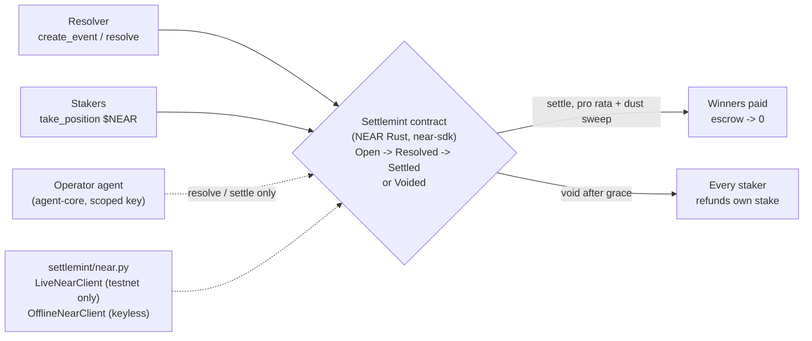

<span class="kicker">A candidate entry &middot; NEAR Protocol Rewards</span>

# Settlemint

### A NEAR event market that settles itself, to the last yocto.

One resolver opens a binary Yes/No market. Stakers commit yoctoNEAR while it is
open. When the outcome is known, the resolver records it once and every winner is
paid pro rata in a single pass, so escrow lands at exactly zero.

**Milestone 1**: the NEAR-native Rust settlement core. Testnet only.

doom2quake &middot; Dipankar Sarkar

---

## The gap that costs money

An on-chain event market has a settlement problem that predates crypto.

- Someone decides the outcome, someone pays every winner, and everyone else must
  be able to check that the payout matched the outcome.
- A **liveness** failure: if the resolver key goes silent, escrow can sit locked
  with no escape.
- An **accounting** failure: pari-mutuel payout is a division, and naive floor
  division drops a remainder, so some winner is quietly short-changed.

> "The market settled" hides both failures. Settlemint makes settlement
> mechanical, complete, and checkable once an outcome is recorded.

---

## The mechanism

Four phases, one file, no dependency beyond `near-sdk`.

- **Open.** `create_event` names a resolver and a close timestamp.
  `take_position` attaches yoctoNEAR on Yes or No while the market is open.
- **Resolved.** Only the named resolver may `resolve`, and only at or after
  close, so the market cannot be cut off mid-flight.
- **Settled.** `settle` pays each account pro rata. The **last** unclaimed winner
  takes the remaining escrow instead of a floor share, so dust is paid out, not
  stranded. Reached only when escrow hits zero.
- **Voided.** If the resolver never shows, anyone may `void_event` after
  `close + 7 days`, and every staker withdraws their own stake.

---

## The invariant: conservation to the last yocto

On a resolved market, an account that staked `m` on the winning side, with
winning pool `W` and total pool `T`, is owed:

```
payout = floor( T * m / W )      for every winner but the last
       = remaining escrow        for the last unclaimed winner
```

- **No overpayment.** Each account is marked `claimed` before its transfer is
  scheduled, and each floor share is at most its exact proportional share.
- **No underpayment.** The last winner sweeps whatever escrow is left, so the
  total paid equals the sum of stakes and `escrow` reaches `0`.

A market is reported `Settled` only once escrow is zero, so a partly-paid market
is never mistaken for a final one. The parity suite pins this in two languages.

---

## Why NEAR carries this

Two NEAR features make this design fit the chain rather than merely run on it.

- **Scoped access keys.** NEAR separates full-access keys from named
  function-call access keys. An operator agent can hold a key restricted to
  `resolve` and `settle`, so a compromised agent can advance markets but **cannot
  drain an account**. The blast radius is exactly two methods.
- **Predictable low fees, yocto accounting.** The one-resolve-plus-one-settle
  pattern is cheap enough to run at cadence, and the pari-mutuel remainder is a
  genuine integer the contract must account for, not a floating-point artifact.

NEAR-native Rust compiled to WASM, not a Solidity port. The state machine was
reimplemented against the NEAR runtime.

---

## Architecture



The funder's technology is load-bearing behind an adapter seam. `LiveNearClient`
talks to NEAR testnet over JSON-RPC and **refuses any mainnet endpoint**;
`OfflineNearClient` replays the same arithmetic keyless, so `docs/run.json` is a
genuine execution trace, not a mock.

---

## Verified, not asserted

| Suite | Command | Result |
| --- | --- | --- |
| NEAR Rust core | `cargo test` | **23 passing** |
| Python model, parity, fixtures | `pytest tests -q` | **32 passing** |
| Deployable artifact | `cargo build --release` | **205 KB WASM** |

- The Python parity suite asserts the **exact** payout literals the Rust tests
  assert (150/50 pro-rata, 1/1/3 dust sweep, 140/100 liability), so the on-chain
  and off-chain math cannot drift without failing a test on one side.
- The run-fixture test checks the committed run conserves value to the last yocto
  and reproduces exactly. Every defence has a test that fails without it.

---

## Honest limits (stated plainly)

- **No mainnet, ever, in this scope.** The live client rejects mainnet endpoints
  in code. All work is NEAR testnet only.
- **No public testnet deploy transaction yet.** The WASM builds; this repo ships
  no funded key, so it records the run offline and claims no receipt it cannot
  show.
- **No users, no revenue, no partnerships, no audit.** The 55 passing tests
  across both suites are our own.

Our substitute for traction is cross-language-tested code and a candid scope map.
See `docs/LIMITATIONS.md`.

---

## Built for NEAR Protocol Rewards

NEAR Protocol Rewards scores **measured on-chain activity** (contract calls,
unique wallets) directly, so an agent that settles many small testnet markets
produces exactly the honest, measured activity the programme is built to reward.

1. **M1 (this):** NEAR-native settlement core, 23 Rust + 32 Python tests, 205 KB WASM.
2. **M2:** verifiable resolution, a reasoning-hash commitment stored at settlement.
3. **M3:** operator agent driving NEAR over a **scoped function-call access key**, on agent-core.
4. **M4:** hosted-offline UI, integration guide, and a forkable template.

**The durable contribution:** a standard, tested answer to how a market settles
on NEAR without stranding a yocto, established before mainnet. This is a grant
application, not an endorsement. Testnet only.
